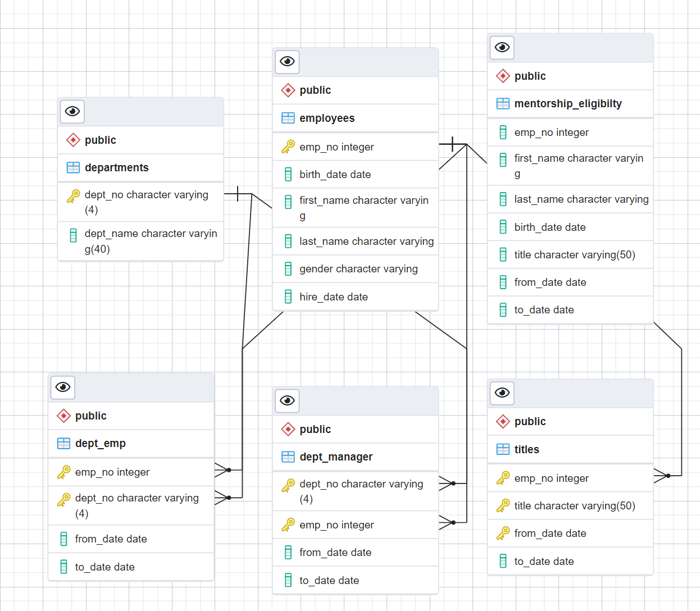
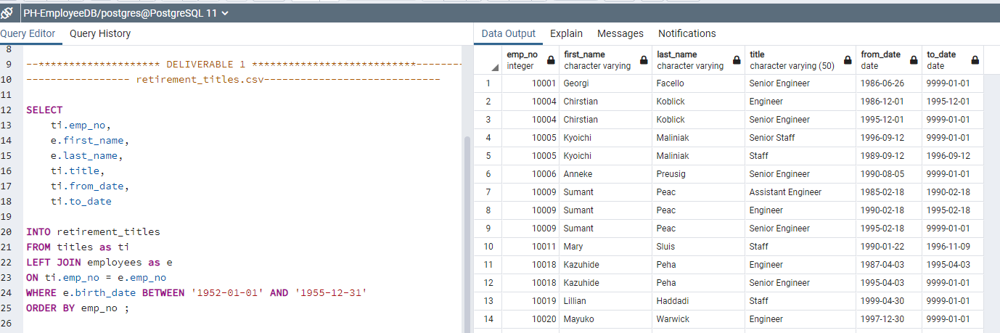
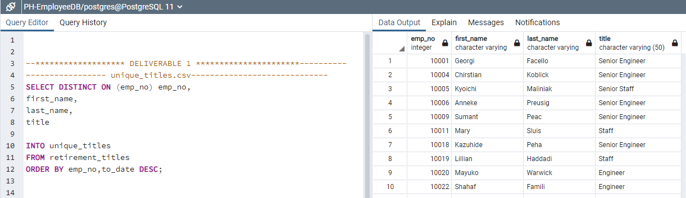
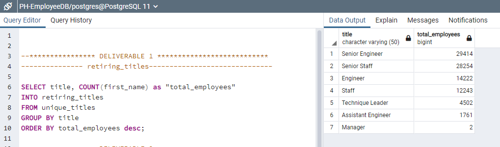
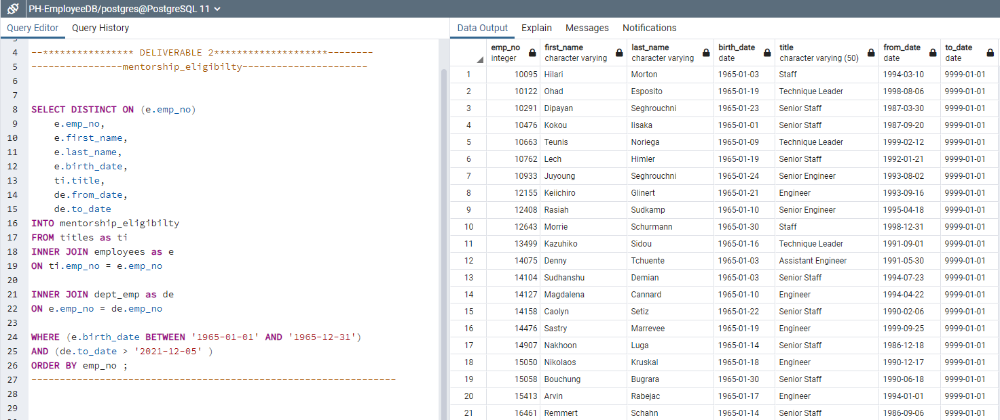
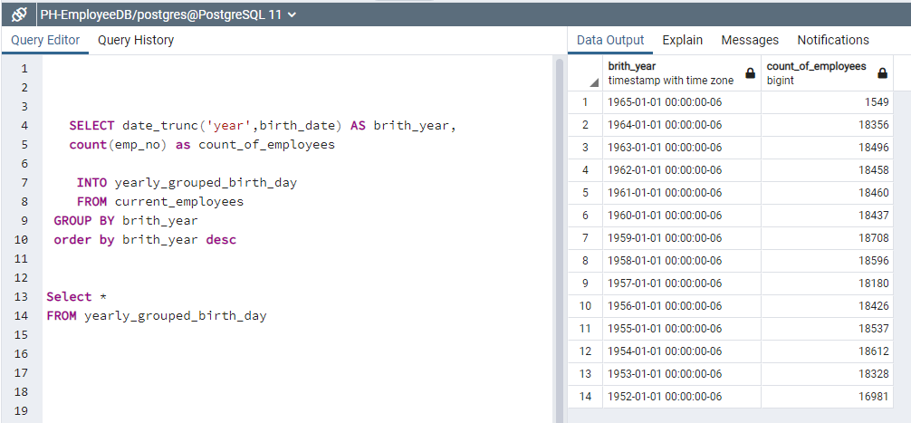
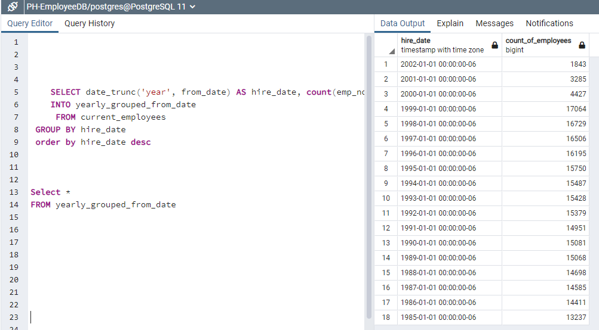
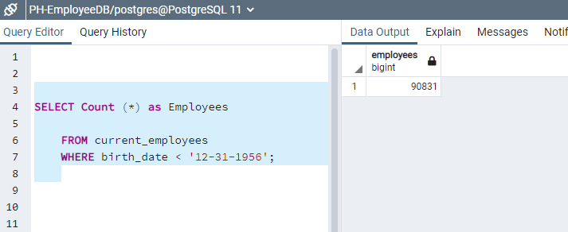

# Pewlett-Hackard-Analysis, Retiring employees and  mentorship program.

## 1. Overview of the analysis

This is the challenge activity for the module 7 of the Data Analytics and Visualization Boot Camp of the university of Texas at Austin.
The main idea is to apply the learned skills of Structured Query Language (SQL).

The project  was based on data of about  331 ,000 employees of the company Pewlett-Hackard.
The main objective of the analysis was to determine the number of retiring employees per title, and identify employees who are eligible to participate in a mentorship program.

## 2. Results:

### Deliverable 1: The Number of Retiring Employees by Title 

First a ERD was created to understand the  structure of the data. See image above.

 

Using SQL queries,  I created the Retirement Titles table  shown above.
This table holds all the titles of current employees who were born between January 1, 1952 and December 31, 1955

There were duplicate entries for some employees because they have switched titles over the years.
I used  the  DISTINCT ON statement to remove these duplicates and keep only the most recent title of each employee.

Then using the GROUP BY statement I was able to generate the table  that can be seen above, where we have the number of retiring employees per title.

### Deliverable 2 : The Employees Eligible for the Mentorship Program

I created the query shown above to create a Mentorship Eligibility table for current employees who were born between January 1, 1965 and December 31, 1965.
The result was 1,549 employees.

## 3. Summary: 

### Summary:  We have two importan questions below:
	
### How many roles will need to be filled as the "silver tsunami" begins to make an impact?
-	As we can see in the table below,  in the next 5 years  90 thousand employees will have to retire. 
-	This company needs to hire about 18,000 employes per year for the next 5 years.

	
-	In the table below we can see that in the last 3 years , the company only has hired  9,000  employees.
-	This company needs to start hiring people urgenlty, so that can fill the gaps 

### Are there enough qualified, retirement-ready employees in the departments to mentor the next generation of Pewlett Hackard employees?
-	As we previuosly stated, there are about 90 thousand employees that will retire in the next 5 years , We surely have lots of talent and enough people to train the future leaders of the company

